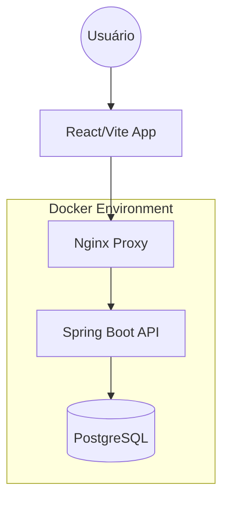

# 📋 ProjetaFinalDB - To-Do List Application


Uma aplicação Full Stack robusta para gerenciamento de tarefas, desenvolvida como projeto final para a disciplina de **Banco de Dados II** na **Jala University**. A solução integra um backend Spring Boot performático com um banco de dados PostgreSQL seguro e um frontend moderno em React (Vite).

---

## 🏗️ Arquitetura do Sistema

A aplicação segue uma arquitetura moderna e escalável, utilizando containers Docker para orquestração de todos os serviços.



---

## 🚀 Funcionalidades Principais

- **Autenticação Segura**: Gerenciamento de usuários com senhas criptografadas nativamente no banco de dados via `pgcrypto`.
- **Gestão de Categorias**: Organize suas tarefas por categorias personalizadas com cores identificadoras.
- **Controle de Tarefas (CRUD)**: Fluxo completo de criação, visualização, atualização e remoção de tarefas.
- **Filtros Dinâmicos**: Filtragem inteligente por usuário e categoria.
- **Interface Responsiva**: Design moderno com suporte a Dark Mode e animações fluidas.

---

## 🛠️ Tecnologias Utilizadas

### Backend
- **Java 17** & **Spring Boot 3.x**
- **Spring Data JPA** (Hibernate)
- **Spring Validation**
- **Maven** (Gerenciamento de dependências)

### Frontend
- **React 18** & **Vite**
- **Axios** (Integração com API)
- **Vanilla CSS** (Design moderno e responsivo)

### Infraestrutura
- **PostgreSQL 15** (Extensão `pgcrypto` para segurança)
- **Docker & Docker Compose**
- **Nginx** (Servidor de arquivos estáticos e Load Balancer)

---

## 🚦 Como Executar

A maneira mais rápida e fácil de rodar o projeto localmente é utilizando o Docker Compose, que automatiza a configuração de todo o ambiente.

### Pré-requisitos
- [Docker](https://www.docker.com/) instalado.
- [Docker Compose](https://docs.docker.com/compose/) instalado.

### Passo a Passo
1. **Clone o repositório**:
   ```bash
   git clone https://github.com/RomarioSG1998/ProjetoFinalDB_2_TODOLIST.git
   cd ProjetoFinalDB_2_TODOLIST
   ```

2. **Inicie os containers**:
   ```bash
   docker-compose up --build -d
   ```

3. **Acesse as aplicações**:
   - **Frontend**: [http://localhost](http://localhost)
   - **Backend API**: [http://localhost:8081](http://localhost:8081)
   - **Documentação API (DML/DDL)**: Disponível na pasta `/scripts_sql`

---

## 📖 Estrutura de Diretórios

```text
.
├── frontend/           # Aplicação React (interface do usuário)
├── src/                # Código fonte do Backend (Java/Spring)
├── scripts_sql/        # Definições de Banco de Dados (DDL e DML)
├── docker-compose.yml  # Orquestração de containers local
└── README.md           # Você está aqui
```

---

## 🔒 Segurança e Banco de Dados

Um diferencial deste projeto é a delegação da segurança ao SGBD. Todas as hashes de senhas são geradas e verificadas diretamente pelo PostgreSQL utilizando a extensão `pgcrypto`, garantindo que senhas em texto puro nunca sejam expostas, nem mesmo na camada de aplicação.

---

## 📝 Licença

Este projeto foi desenvolvido para fins educacionais na **Jala University**.

Desenvolvido por **Romário Jala** e Equipe. 🚀
