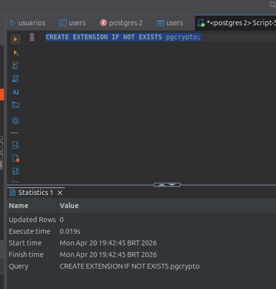

# Roteiro de Apresentação: Segurança e Validação

Este documento serve como guia para a apresentação do requisito de **Segurança e Validação de Campos** implementado no projeto.

## 🎯 Objetivo do Requisito
*"Utilizar funções de criptografia existentes ou personalizadas de acordo com o gerenciador de banco de dados escolhido. Certificar-se de que os campos estejam corretamente validados de acordo com os critérios (no console)."*

---

## 1. Criptografia no Banco de Dados (PostgreSQL)

Para cumprir a exigência de usar funções de criptografia do gerenciador de banco de dados escolhido, integramos a extensão **pgcrypto** do PostgreSQL diretamente na nossa camada de dados (Spring Boot Repository).

### Passo 1: Habilitando a Função no Banco
Para que a aplicação pudesse acessar as funções nativas de senha do PostgreSQL, a primeira etapa consistiu em ativar a extensão diretamente no banco de dados. Conforme ilustramos na execução abaixo (via DBeaver), enviamos o comando para garantir o módulo de criptografia:

  
*(Lembre-se de salvar o print na sua pasta de estudos e colocar o nome correto ou o caminho da imagem no lugar de "sua_imagem_do_dbeaver.png")*

Além da execução direta, também mantemos isso mapeado via script para reprodutibilidade:
```sql
-- Script: setup_database.sql
CREATE EXTENSION IF NOT EXISTS pgcrypto;
```

### Passo 2: A Aplicação e o Repositório
No nosso código Java, não fazemos o processamento do Hash localmente. Ao invés disso, utilizamos `Native Queries` no **UserRepository** para delegar essa função exclusivamente ao banco de dados utilizando a função `crypt()`:

```java
@Modifying
@Transactional
@Query(value = "INSERT INTO users (username, email, password_hash, created_at) VALUES (:username, :email, crypt(:rawPassword, gen_salt('bf')), CURRENT_TIMESTAMP)", nativeQuery = true)
void saveUserWithHash(@Param("username") String username, @Param("email") String email, @Param("rawPassword") String rawPassword);
```
**O que explicar aqui:**
* Em vez de enviar a senha em texto limpo e usar o clássico `save()` do JPA, montamos o INSERT forçando o PostgreSQL a aplicar o `crypt` com `gen_salt('bf')` (Blowfish/Bcrypt).
* Isso garante que apenas o banco de dados conheça o processo de geração e armazenamento final do hash.

### Passo 3: Autenticação via Banco
Para acessar o sistema, a validação de login também é delegada ao banco:
```java
@Query(value = "SELECT * FROM users WHERE email = :email AND password_hash = crypt(:rawPassword, password_hash)", nativeQuery = true)
Optional<User> loginWithHash(@Param("email") String email, @Param("rawPassword") String rawPassword);
```
**O que explicar aqui:**
* O SGBD pega a senha fornecida pelo usuário, a submete pela mesma função `crypt` e compara nativamente, retornando o usuário apenas em caso de sucesso. O Backend jamais trafega ou compara a senha descriptografada.

> 🗣️ <sub>*"Para cumprir o requisito de criptografia diretamente no banco de dados, nós fomos ao PostgreSQL e ativamos a extensão `pgcrypto`, como mostra esta imagem da nossa execução no DBeaver. Nossas consultas de inserção e login no código utilizam a função `crypt()` de forma nativa. O legal disso é que o Spring Boot nunca precisa enxergar a senha original na hora do login, deixando o próprio banco comparar os hashes via Query. Isso traz muito mais segurança pra aplicação."*</sub>

---

## 2. Validação dos Campos e Saída no Console

A segunda parte do requisito exige que os campos obedeçam a critérios corretos e isso seja perceptível (ex: log console). 

Utilizamos **Jakarta Validation (Spring Boot Validation)** diretamente na entidade (Model).

### Exibindo o Código (Model `User.java`)
```java
    @NotBlank(message = "Username não pode ficar em branco")
    @Size(min = 3, max = 50, message = "Username deve ter entre 3 e 50 caracteres")
    @Column(length = 50, nullable = false)
    private String username;

    @NotBlank(message = "E-mail não pode ficar em branco")
    @Email(message = "E-mail com formato inválido")
    @Column(length = 100, nullable = false, unique = true)
    private String email;

    @NotBlank(message = "A senha não pode ficar em branco")
    @Size(min = 6, message = "A senha deve conter no mínimo 6 caracteres")
    private String passwordHash; // O input cru não pode ter menos que 6 chars
```

### Como Explicar (Prova da Validação / Console)
**O que explicar aqui:**
* Graças às anotações (`@Valid` em Controllers e `@NotBlank`/`@Size` na Entidade), a nossa API intercepta as requisições *antes* mesmo de chegar ao banco de dados.
* **Demonstração:** Na vida real, ao fazer um POST via Postman/Insomnia passando uma senha de "123" ou um e-mail falso ("teste@"), o Spring Boot imediatamente dispára uma `MethodArgumentNotValidException`. 
* **O Console:** Essa rejeição gera um **Traceability Log no Console** com as mensagens configuradas, provando que o sistema bloqueou as entradas ruins.

> 🗣️ <sub>*"Em relação às validações exigidas de que os campos devem respeitar limites, nós resolvemos isso utilizando as anotações do Jakarta direto na nossa Entidade `User`. Se a gente enviar pelo Insomnia um e-mail falso sem o `@`, ou uma senha muito curta, a nossa API nem deixa chegar no banco. Ela lança uma `MethodArgumentNotValidException` e retorna uma mensagem para nós exatamente aqui no log do Console, comprovando que barrou o acesso inválido."*</sub>

---

## 3. Funcionalidades de Lista de Tarefas (To-Do List)

Na sequência da arquitetura do aplicativo, a apresentação deve cobrir o núcleo operacional da lista de tarefas, que fornece as ferramentas necessárias para a gestão do dia a dia do usuário.

### Gestão Completa de Tarefas (CRUD)
O sistema implementa de forma completa as interações padrão esperadas em um To-Do List:
* **Adicionar Tarefas:** Permitindo o registro de novas pendências com seus detalhes.
* **Editar Tarefas:** Garantindo flexibilidade na alteração de títulos, descrições ou urgência.
* **Eliminar Tarefas:** Mantendo o sistema limpo com a remoção de tarefas indesejadas.

**Exemplo de Implementação no Backend (`TaskController.java`):**
```java
@PostMapping("/task")
public Task salvar(@RequestBody Task task) {
    taskValidator.validateForSave(task);
    return taskRepository.save(task);
}

@PutMapping("/task/{id}")
public Task atualizar(@PathVariable Long id, @RequestBody Task taskDetails) {
    // Busca a tarefa, atualiza seus detalhes, valida e salva novamente
    return taskRepository.findById(id).map(task -> {
        task.setNome(taskDetails.getNome());
        task.setDescricao(taskDetails.getDescricao());
        task.setImportancia(taskDetails.getImportancia());
        taskValidator.validateForSave(task);
        return taskRepository.save(task);
    }).orElseThrow(() -> new RuntimeException("Tarefa não encontrada"));
}
```

### Acompanhamento e Status
* **Status da Tarefa:** A aplicação permite que o estado atual de uma tarefa seja reportado (Exemplo: *Nova, Em andamento, Concluída, Pendente*). Isso traz visão gerencial macro.
* **Marcar como Concluída:** Ação simples na interface cujo objetivo é unicamente registrar e dar baixa visual e lógica em uma tarefa que já foi finalizada.

> 🗣️ <sub>*"Sobre as rotinas do 'To-Do List', implementamos um CRUD completo, para **adicionar, editar e deletar** os itens. Pensando em gerência, também deixamos registrado o acompanhamento de progresso. Isso significa que as tarefas trafegam com um Status de 'Nova, Pendente ou Em Andamento', além de ter o fluxo interativo no frontend pra apenas realizar a marcação de 'Concluída'."*</sub>

---

## 4. Gestão e Organização de Categorias

Para não termos uma longa lista confusa, cada tarefa é segmentada no banco de dados.

### A Regra de 1:N (Pertencimento Único)
* Optamos por um design onde **uma tarefa só pode pertencer a uma única categoria**. Isso cria pastas bem delimitadas de organização.

**Visualizando a Relação na Entidade (`Task.java`):**
```java
// Cada Tarefa tem apenas uma categoria, mas uma Categoria tem várias Tarefas
@ManyToOne(fetch = FetchType.EAGER)
@JoinColumn(name = "category_id")
private Category category;

@ManyToOne(fetch = FetchType.EAGER)
@JoinColumn(name = "user_id")
private User user;
```

### Categorias Padrão vs Escolhidas
* **Fator Default:** Em nosso backend, caso o usuário crie uma tarefa sem especificar seu local, ela é designada para uma categoria padrão (ex.: *Categoria -> Geral*).
* **Flexibilidade:** Caso deseje, o usuário insere a tarefa numa pasta definida (ex.: *Categoria -> Universidade*).

### Gerenciamento Completo das Categorias
As próprias categorias são entidades flexíveis no banco de dados. Para suprir a necessidade orgânica dos usuários, nosso frontend/backend permite que as categorias também sejam:
* **Adicionadas** (Para novas organizações diárias)
* **Editadas** (Para corrigir um nome ou cor)
* **Excluídas** (Para quando um contexto de projeto acaba)

> 🗣️ <sub>*"Para fechar a parte principal, organizamos as tarefas com Categorias obedecendo o relacionamento 1 para 'N'. Isso significa que não existe dupla atribuição: uma tarefa só pertence a uma pasta por vez. Funciona da seguinte forma: se você não especifica o destino, a tarefa vai pra uma **Categoria Padrão** (como 'Geral'). Caso contrário, você pode gerenciar e montar pastas próprias para a faculdade ou trabalho, pois o módulo de categoria também permite que elas sejam criadas, atualizadas e excluídas livremente pelo usuário."*</sub>
